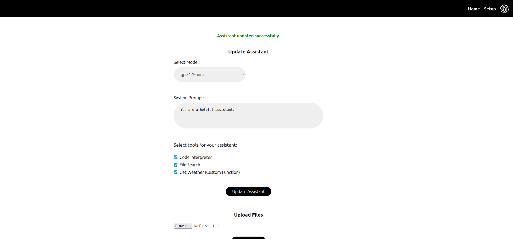

# OpenAI Assistants API Quickstart with Python, Jinja2, and FastAPI

A quick-start template using the OpenAI [Assistants API](https://platform.openai.com/docs/assistants/overview) with [Python](https://www.python.org/), [Jinja2](https://jinja.palletsprojects.com/en/3.1.x/), and [FastAPI](https://fastapi.tiangolo.com/).

## Quickstart Setup

### 1. Clone repo

```shell
git clone https://github.com/Promptly-Technologies-LLC/openai-assistants-python-quickstart.git
cd openai-assistants-python-quickstart
```

### 2. Install dependencies

```shell
uv sync
```

### 3. Run the FastAPI server

```shell
uv run uvicorn main:app --host 0.0.0.0 --port 8000 --reload
```

### 4. Navigate to [http://localhost:8000](http://localhost:8000).

### 5. Set your OpenAI API key and create an assistant in the GUI

## Usage

Navigate to the `/setup` page at any time to configure your assistant:



Navigate to the `/chat` page to begin a chat session:


If your OPENAI_API_KEY or ASSISTANT_ID are not set, you will be redirected to `/setup` where you can set them. (The values will be saved in a `.env` file in the root of the project.)

The assistant is capable of multi-step workflows involving multiple chained tool calls, including file searches, code execution, and calling custom functions. Tool calls will be displayed in the chat as they are processed.

## Defining Your Own Custom Functions

Define custom functions in the `utils/custom_functions.py` file. An example `get_weather` function is provided. You will need to import your function in `routers/chat.py` and add your execution logic to the `event_generator` function (search for `get_weather` in that file to see a function execution example). See also `templates/components/weather-widget.html` for an example widget for displaying the function call results.

Ultimately I plan to support a more intuitive workflow for defining custom functions, and perhaps I'll even add MCP support. Please contribute a PR if you'd like to help!
